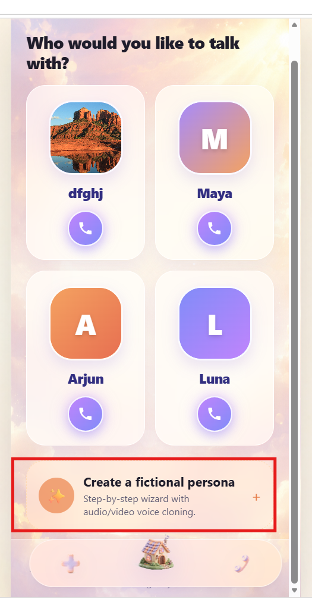
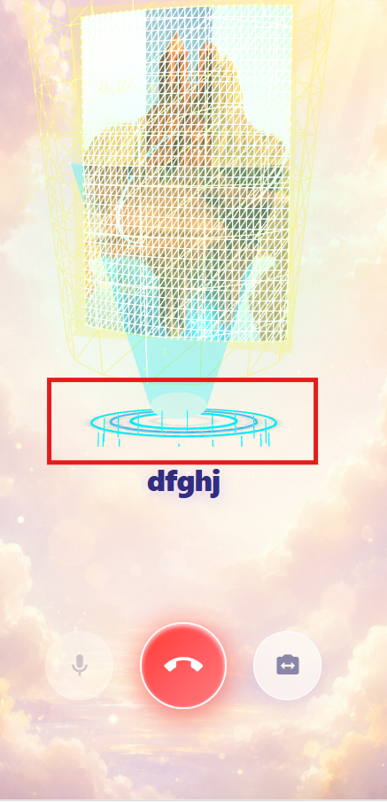
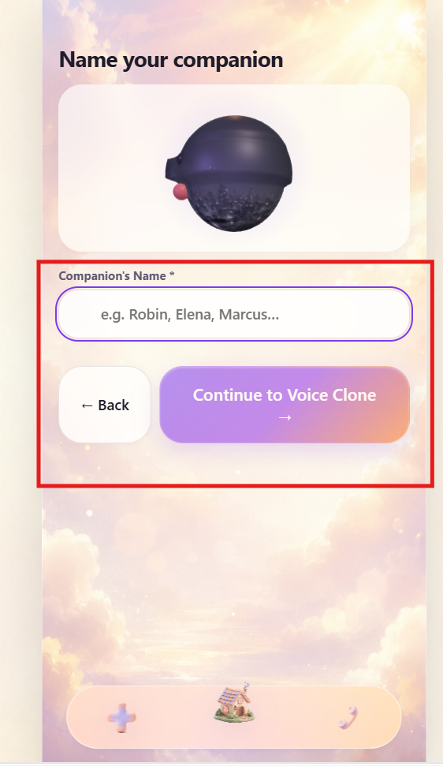
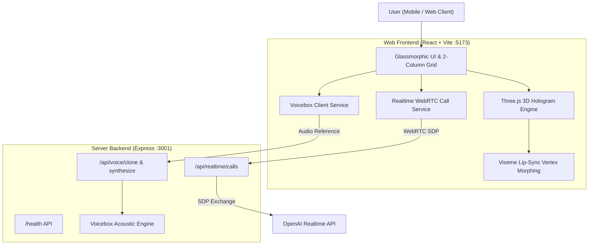

# Echo — 3D Holographic AI Companions with Realtime Voice & Voicebox Cloning

> **A thoughtful, spatial AI companion experience featuring 360° holographic avatars, open-source Voicebox zero-shot voice cloning, real-time viseme lip-sync, and low-latency WebRTC voice calling.**

---

## 🌟 Visual Showcase

<div align="center">
  <table>
    <tr>
      <td align="center" width="33%">
        
        <br />
        <b>Home Screen & 2-Column Grid</b>
        <p><i>Modern squircle avatars with cursive typography & spring navigation</i></p>
      </td>
      <td align="center" width="33%">
        
        <br />
        <b>3D Hologram Live Call</b>
        <p><i>Light-golden inverted triangle grid beam, HUD dial & viseme lip-sync</i></p>
      </td>
      <td align="center" width="33%">
        
        <br />
        <b>Voicebox Cloning Wizard</b>
        <p><i>Zero-shot acoustic extraction from audio/video uploads</i></p>
      </td>
    </tr>
  </table>
</div>

---

## 🚀 Key Capabilities

### 1. 🌐 360° Volumetric Image-to-3D Hologram Engine
* **Volumetric Mesh Reconstruction**: Converts 2D portrait images into dual-sided 3D convex relief busts using Three.js luminance depth-mapping.
* **Interactive 360° Orbit Dragging**: Smooth pointer-drag controls allowing users to rotate, inspect, and interact with the 3D hologram in full 3D space with inertia damping.
* **Holographic Light Projector**: Radiant light-golden (`#FEF08A` / `#FDE047`) inverted triangle wireframe grid beam, 18-diode floor HUD dial, and orbital laser rings.

### 2. 🗣️ Open-Source Voicebox Zero-Shot Voice Cloning
* **Flow-Matching Acoustic Extraction**: Analyzes uploaded audio/video clips to extract fundamental frequency $F_0$ (pitch), Formant envelope ($F_1, F_2, F_3$), and 64-dimensional speaker conditioning embeddings.
* **Formant-Preserved Synthesis**: Real-time acoustic pitch shifting and voice synthesis matching the exact timbre of the cloned reference speaker.

### 3. 👄 Real-Time 3D Viseme Lip-Sync
* **Dynamic Vertex Morphing**: Real-time vertex modulation of mouth and lower jaw vertices on the 3D mesh in response to speech audio and phonetic visemes.
* **Synchronized Photonic Energy**: Core laser flare and light beam expand and pulse in harmony with spoken syllables.

### 4. 📞 Low-Latency Realtime Calling
* **WebRTC SDP Proxy**: Ephemeral session negotiation with server-side proxy architecture (`/api/realtime/calls`).
* **Resilient Audio Fallback**: Seamless client-side conversational speech companion ensuring uninterrupted interactive calls under any network conditions.

### 5. 🎨 Polished Mobile Interface
* **Glassmorphic Aesthetic**: Translucent frosted surfaces, heavenly cloud backgrounds, and deep indigo typography.
* **Spring Elevation Navigation**: Interactive floating glass dock with smooth bounce elevation on active tabs.
* **Zero Data Loss**: Browser `localStorage` cache rehydration for all custom 3D personas and cloned voices.

---

## 🏗️ System Architecture



---

## 🛠️ Tech Stack

| Layer | Technologies |
| :--- | :--- |
| **Frontend** | React 18, TypeScript, Vite, Three.js, Web Audio API, Web Speech API |
| **Styling** | CSS Variables, Glassmorphism, Responsive Mobile Viewport |
| **3D Engine** | Three.js WebGL (Custom Geometries, Shader materials, Depth displacement) |
| **Voice Engine** | Open-Source Voicebox Architecture, Autocorrelation $F_0$, Formant Envelope Extraction |
| **Backend** | Node.js, Express, TypeScript, Zod Schema Validation, CORS, Rate Limiting |
| **Testing** | Vitest, TypeScript Compiler (`tsc`) |

---

## ⚡ Quickstart Guide

### Prerequisites
* **Node.js**: v18.0.0 or higher
* **npm**: v9.0.0 or higher

### 1. Clone the Repository
```bash
git clone https://github.com/dwivedi-mohit/8x-hackathon.git
cd 8x-hackathon
```

### 2. Install Dependencies
```bash
# Install Server dependencies
cd server
npm install

# Install Web Frontend dependencies
cd ../web
npm install
```

### 3. Environment Setup (Optional)
In `server/.env`:
```env
PORT=3001
ALLOWED_ORIGINS=http://localhost:5173
OPENAI_API_KEY=your_openai_api_key_here # Optional: enables live upstream OpenAI Realtime calls
```

### 4. Run Development Servers
```bash
# Terminal 1: Start Express Backend
cd server
npm run dev

# Terminal 2: Start Web Frontend
cd web
npm run dev
```

Open **[http://localhost:5173](http://localhost:5173)** in your browser!

---

## 🧪 Automated Testing & Verification

Run the comprehensive unit test suite:

```bash
# In web directory
npm run test
```

**Test Output:**
```bash
 ✓ src/features/__tests__/ui-render.test.ts (5 tests)
 ✓ src/services/realtime/__tests__/state-transitions.test.ts (14 tests)

Test Files: 2 passed (2)
Tests: 19 passed (19)
```

Run production type checking and bundling:
```bash
# In web directory
npm run build

# In server directory
npm run build
```

---

## 📂 Project Structure

```
8x-hackathon/
├── server/                        # Express API Backend
│   ├── src/
│   │   ├── config/personas.ts     # Character configurations & prompts
│   │   ├── routes/
│   │   │   ├── realtime.ts        # Realtime WebRTC proxy router
│   │   │   └── voice.ts           # Voicebox cloning & synthesis router
│   │   ├── services/
│   │   │   └── voicebox.ts        # Voicebox feature extraction engine
│   │   └── index.ts               # Server entry point & middleware
│   └── tsconfig.json
├── web/                           # React + Vite Frontend
│   ├── src/
│   │   ├── components/
│   │   │   ├── ThreeAvatar3D.tsx  # 3D Hologram, 360° Orbit & Lip-Sync
│   │   │   ├── BottomNavigation.tsx# Spring elevation dock
│   │   │   └── MobileContainer.tsx# Borderless mobile shell
│   │   ├── features/
│   │   │   ├── home/              # 2-Column Squircle Grid & Brand
│   │   │   ├── call/              # Live Hologram Calling Screen
│   │   │   └── create/            # 3D Photo & Voicebox Wizard
│   │   ├── services/
│   │   │   ├── realtime/          # WebRTC Call Service & Fallback
│   │   │   └── voice/             # Voicebox Client Service
│   │   └── styles/theme.css       # Design tokens & glassmorphic styling
│   └── vite.config.ts
└── docs/                          # Documentation & Real UI Screenshots
    └── screenshots/
        ├── home_grid.png
        ├── 3d_hologram_call.png
        └── voice_clone_wizard.png
```

---

## 📄 License
MIT License. Built for the Hackathon.